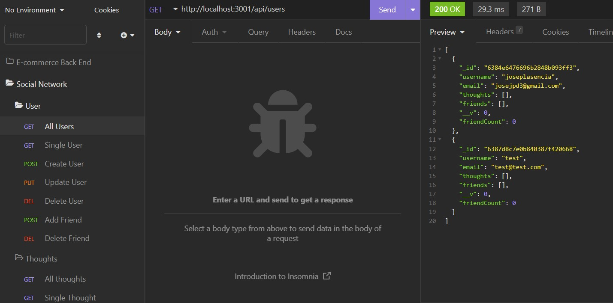

# 18-Module-Challenge

### NoSQL Challenge: Social Network API

---

## Social Network API

The [Social Network API](https://watch.screencastify.com/v/xfZhWx9TOyrk42nL3J1I) application allows an user to create, update, delete and view all users, thoughts, reactions and the ability to add friends though several https requests.

---

## Instructions [(Walk Through Video)](https://watch.screencastify.com/v/xfZhWx9TOyrk42nL3J1I) 

1. Clone down the repository
```
git clone git@github.com:Josejpd3/18-Module-Challenge.git
```
2. Enter in to **18-Module-Challenge** repo
```
cd 18-Module-Challenge
```
3. Install dependencies
```
npm i
```
4. Run the application
```
nodemon
```
5. Interact with data through https requests



